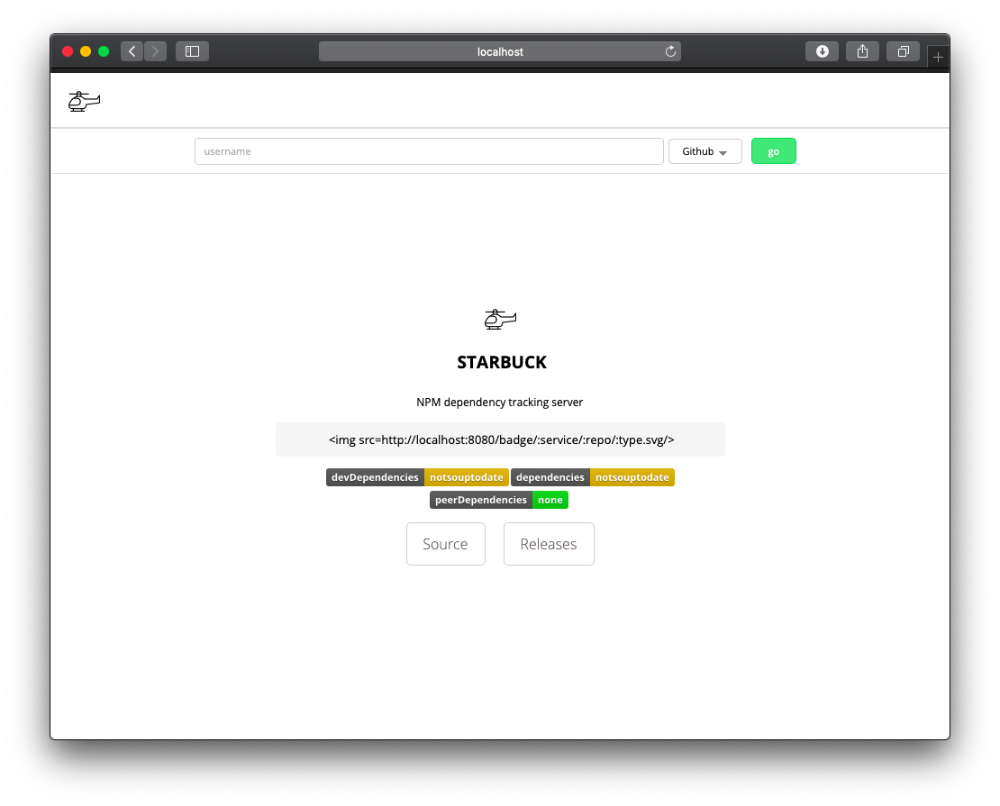

# starbuck

> 📦 NPM dependency tracking server

[](https://www.npmjs.com/package/starbuck)
[](https://travis-ci.org/gabrielcsapo/starbuck)
[](https://lcov-server.gabrielcsapo.com/coverage/github%2Ecom/gabrielcsapo/starbuck)
[](https://starbuck.gabrielcsapo.com/github/gabrielcsapo/starbuck)
[](https://starbuck.gabrielcsapo.com/github/gabrielcsapo/starbuck#info=devDependencies)
[]()
[]()

## Installation

```
npm install starbuck -g
```

## Usage

```
Usage: starbuck [options]


Options:

  -V, --version          output the version number
  -c, --config [config]  Specify a config file to override the defaults
  -h, --help             output usage information
```

This will start up a server at http://localhost:8000 and you should see a page similar to this.


